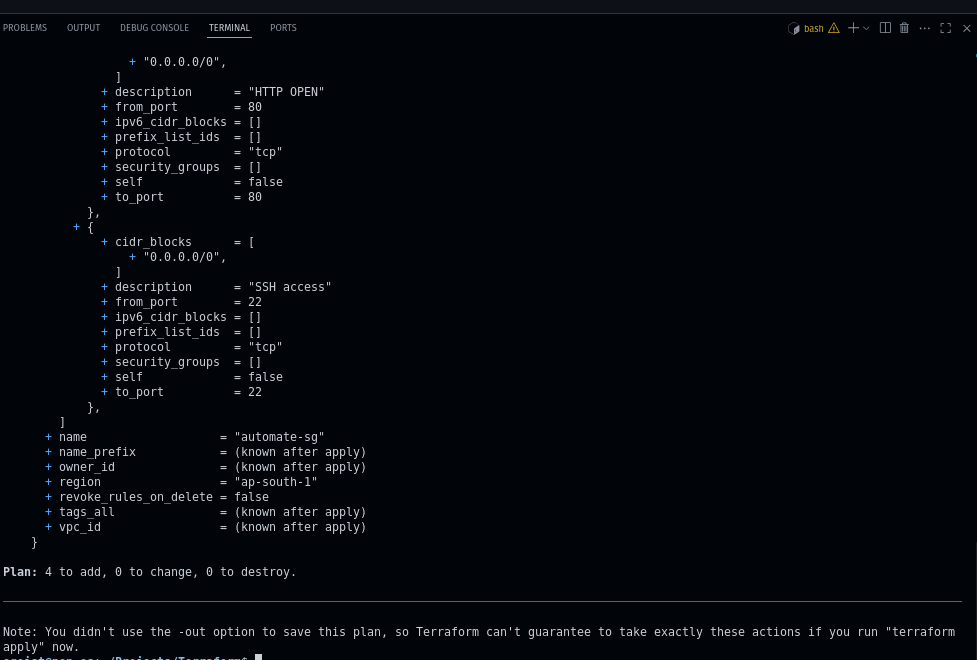
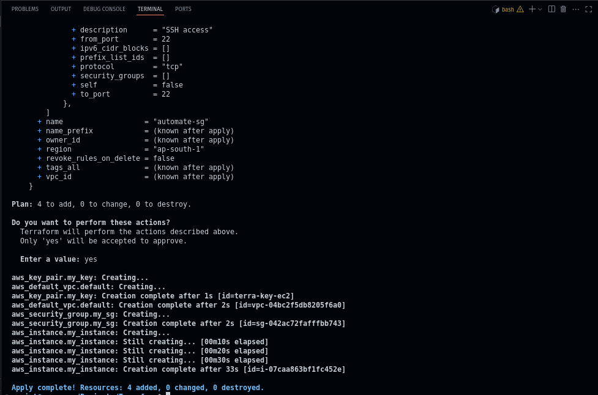
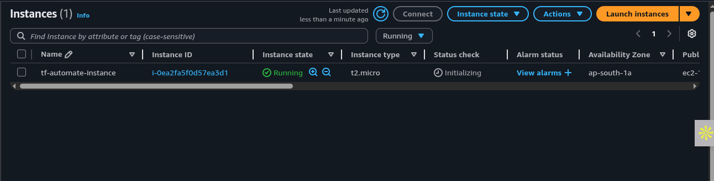
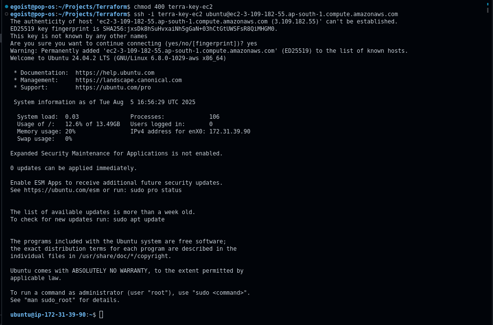
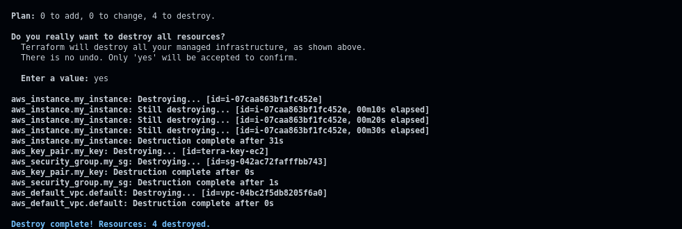

# Terraform EC2 Project

This repository demonstrates how to provision an EC2 instance on AWS using Terraform, including automated SSH key creation, VPC and security group setup, and instance deployment.

---

## 📂 Project Structure

```
.
├── terraform.tf           # Terraform block for provider configuration
├── providers.tf           # AWS provider settings (region, version)
├── ec2.tf                 # Key pair, VPC, security group, and EC2 instance
├── images/                # Screenshots for each Terraform command
│   ├── tf-init.png
│   ├── tf-plan.png
│   ├── tf-apply.png
│   ├── ssh-ec2.png
│   └── destroy.png
├── terra-key-ec2          # 🔒 Private SSH key (ignored)
├── terra-key-ec2.pub      # 🔑 Public SSH key
├── terraform.tfstate      # 🔒 Terraform state (ignored)
├── terraform.tfstate.backup # 🔒 Terraform state backup (ignored)
└── README.md              # This file
```

> **Tip:** Add the above sensitive files and state files to your `.gitignore` to keep secrets and state out of version control.

---

## 📝 Configuration Files

* **terraform.tf**

  * Defines the `terraform` block with required provider source and version.

* **providers.tf**

  * Specifies AWS provider settings such as region and credentials source.

* **ec2.tf**

  1. **SSH Key Pair**

     * Generated with `ssh-keygen` using the filename `terra-key-ec2`.
     * Private key (`terra-key-ec2`) and public key (`.pub`) are ignored by Git.
  2. **VPC**

     * Uses the default VPC for simplicity.
  3. **Security Group**

     * Opens SSH (port 22) and HTTP (port 80) inbound.
     * Allows all outbound traffic.

    
  4. **EC2 Instance**

     * References the key pair and security group.
     * Configures root volume size and type.
     * Tags the instance for easy identification.

---

## 🚀 Deployment Workflow

Follow these steps to provision, connect to, and then destroy the EC2 instance.

### 1. Initialize Terraform

```bash
terraform init
```

---

### 2. Validate Configuration

```bash
terraform validate
```

(Image not required)

---

### 3. Review Execution Plan

```bash
terraform plan
```



---

### 4. Apply Changes

```bash
terraform apply
```



---

### 5. Verify in AWS Console

Check the EC2 Dashboard to see the running instance.



---

### 6. SSH into Instance

```bash
chmod 400 terra-key-ec2
ssh -i terra-key-ec2 ubuntu@<Public-DNS-or-IP>
```



---

### 7. Destroy Resources

```bash
terraform destroy
```



---

## 🎯 Benefits

* **Reproducible infrastructure**: Spin resources up and down reliably.
* **Code-driven**: No manual clicks in the console.
* **Secure handling**: Secrets and state are kept out of version control.

> Codify the past and build for the future with Terraform.

---

> Built by Ego, DevOps & Terraform enthusiast
